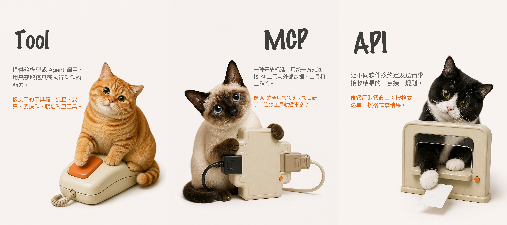

# 咪子分享：AI 黑话科普 Skill

把 AI 课程笔记或一组术语，变成新手也看得懂的中文科普：每期 5 个相关名词，一句准确定义，一个下沉类比，再配一只处境莫名其妙、表情很有戏的真实猫咪。




## 它会做什么

- 从提供的课程笔记中提炼 **5 个主选词 + 3 个备选词或自行提供选词**，优先保证同一期词汇的关联性。
- 核对名词含义，把定义、类比和事实核实分开，避免“为了好懂而讲错”。
- 在文案、视觉故事两处等待确认，再生成 **1 张封面 + 5 张术语页**。
- 生成原创的实拍感猫咪拼贴：可爱、搞怪、表情夸张，但不杂乱、不复制网红猫。
- 用确定性的排版脚本叠加中文，避免乱码；正文和橙色类比优先使用“娃娃体-简”。
- 导出 3000 × 4000 px 的 PNG、JPG，以及文案、来源、提示词和联络表。

## 工作流

```text
课程笔记 / 术语列表
        ↓
筛选 5 个主词 + 3 个备选词
        ↓ 你确认
准确定义 + 人话翻译 + 下沉类比
        ↓ 你确认
封面 + 5 个猫咪视觉故事
        ↓ 你确认
生成无字底图 → 精确排字 → 逐字与尺寸检查
```

这几个确认点是故意保留的：名词正确、类比准确、猫咪笑话对味之后，才进入成本更高的图片生成。

## 视觉规则

- 固定 3:4 竖图，最终尺寸 3000 × 4000 px。
- 一张图只讲一件事：一只真实猫咪、一个核心道具、最多一个小辅助元素。
- 气质是“低技术手势，高质量收尾”：场面无厘头，信息保持准确。
- 留足白色或暖白色呼吸空间，不做卡片、仪表盘、矢量网页结构。
- 科技元素控制在很小的比例，优先用老式电脑、软盘、粗键盘等触感道具。
- 默认不画箭头；确有必要时，只允许一笔松弛、真实融入画面的手绘痕迹。
- 所有可见文字逐字核对。一个乱码、错字或多余符号都会判定为不合格。

详细规范见 [SKILL.md](SKILL.md)、[视觉系统](references/visual-system.md)、[编辑流程](references/editorial-workflow.md) 和 [制作流程](references/production-workflow.md)。

## 安装

需要已支持 Skills 与图片生成的 Codex 环境。

```bash
git clone https://github.com/toolhub-workspace/mizi-ai-glossary-skill.git \
  ~/.codex/skills/t0-mizi-fenxiang-skill

python3 -m pip install -r \
  ~/.codex/skills/t0-mizi-fenxiang-skill/requirements.txt
```

如果目标目录已经存在，请先自行备份或换一个目录；安装命令不会替你覆盖旧版本。

## 调用

在 Codex 中输入：

```text
$t0-mizi-fenxiang-skill

这是第 2 期。请从我附带的课程笔记里选出 5 个同频 AI 名词。
```

也可以直接给 5 个词：

```text
$t0-mizi-fenxiang-skill

这是第 1 期：API、Tool、MCP、Agent、Workflow。
先给我审核文案，不要直接生成图片。
```

Skill 每次都会询问期数，不会自行猜测或自动加一。

## 排字脚本

图片生成完成后，复制示例配置并填写每一页自己的坐标与已审核文案：

```bash
cp assets/templates/issue-config.example.json /你的项目/issue-config.json
python3 scripts/render_issue.py --config /你的项目/issue-config.json
```

脚本只负责精确排字、导出和尺寸检查，不会绘制网页感箭头、卡片或重复版式。默认标题字体使用 macOS 自带字体；其他系统可在配置的 `fonts` 字段中指定本机字体。

正文会优先自动寻找 macOS 字体册中的 `WawaSC-Regular.otf`（娃娃体-简）。该字体是系统授权字体，本仓库不会复制或分发；没有安装它的环境会自动改用仓库中的开源小赖字体。

## 仓库结构

```text
.
├── SKILL.md                    # Skill 的主指令与审核门槛
├── agents/openai.yaml          # Codex 中的显示信息与默认调用语
├── assets/
│   ├── fonts/                  # 小赖字体及其 OFL 许可证
│   ├── style-anchors/          # 已确认的第一期风格锚点
│   └── templates/              # 六页排字配置示例
├── references/                 # 编辑、视觉与制作细则
└── scripts/render_issue.py     # 精确中文排字与导出工具
```

## 许可证

- 代码、Skill 指令、文档与本仓库原创示例素材：MIT License，见 [LICENSE](LICENSE)。
- 兜底字体 `XiaolaiSC-Regular.ttf`：SIL Open Font License 1.1，见 [字体许可证](assets/fonts/OFL.txt) 与 [第三方说明](THIRD_PARTY_NOTICES.md)。

小赖字体来自 [lxgw/kose-font](https://github.com/lxgw/kose-font)。不要单独售卖字体文件。
